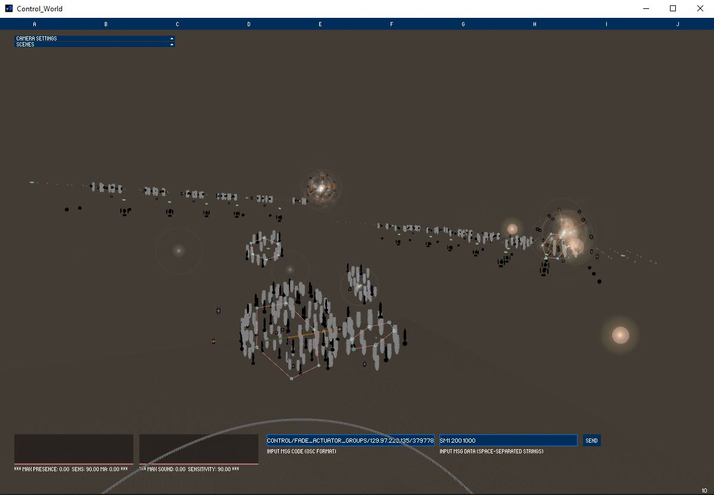
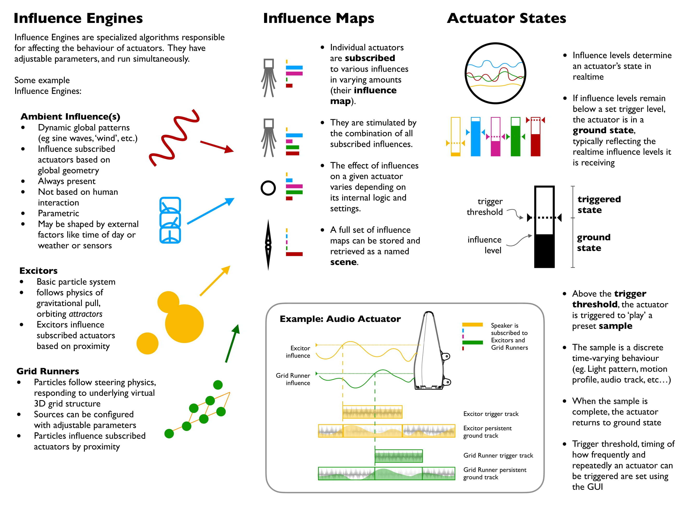
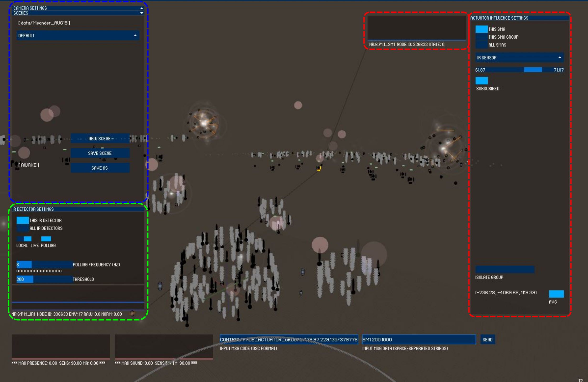
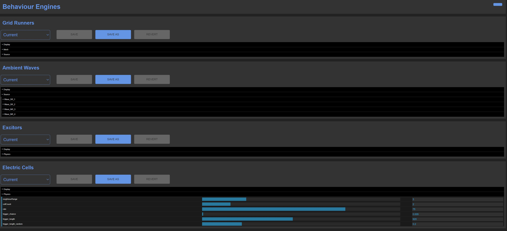

# Processing-Simulator
Processing-Simulator is a [Processing](https://processing.org/)-based behavior engine of a Living Architecture System (LAS) developed by the engineering team from the [Philip Beesley Studio](http://www.philipbeesleystudioinc.com/).

<p  align="center">
	
</p>

> Screenshot of ***Processing Simulator***.

## High-level Design Explanation
<p  align="center">
	
</p>

> Diagram of ***Actuator Behavior in Processing Simulator***.
### Influence Engines
As shown in the diagram, 4 influence engines are designed in the Processing-Simulator, which includes:
* Grid Runners: (defined in `GridRunner.pde`)
    * Particles follow steering physics, responding to underlying virtual 3D grid structure
    * Sources can be configured with adjustabl eparameters
    * Particles influence subscribed actuators by proximity
* Ambient Waves: (defined in `AmbientWaves.pde`)
    * Dynamic global patterns (e.g. sine waves, 'wind', etc.)
    * Influence subscribed actuators based on global geometry
    * Always present
    * Not based on human interaction
    * Parameteric
    * May be shaped by external factors like time of day or weather or sensors
* Excitors: (defined in `Excitors.pde`)
    * Basic particle system
    * Follows physics of gravitational pull, orbiting *attrectors*
    * Excitors influence subscribed actuators based on proximity
* Electric Cells: (defined in `electricCells.pde`) 
    * This behaviour creates fast patterns by jumping between actuators within a given Range (nearest neighbours), at a given Rate (ms).
    * The purpose is to generate semi-random paths that look like electric shocks are moving through the Scultpture

### Influence Maps
Influence map idicates which actuators are affected by which influence engines. Particularly,
* Individual actuators are subscribed to various influences in varying amounts (their influence map)
* They are stimulated by the combintion of all subscribed influences
* The effect of influences on a given actuator varies depending on its internal logic and settings
* A full set of influence maps can be stored and retrived as a named scene
#### Scene Generation
<p  align="center">
    
</p>
The figure hightlights various functions to manapulate the influcence map. Specifically,

* The scene can be loaded and saved using the buttons in the blue box.
* By clicking a sensor, the sensor related settings can be tuned as shwon in the green box.
    * If choose local, the sensor will be simulated rather than pulling the reading from the real sculpture.
* By clicking an actuator, the actuator related settings can be tuned as hightligted in the red box. 
    * To subscribe to an influence engine, Choose the influence from the dropdown manue and click the subscribed.
    * If want to subscribe multiple actuators to an influence engine, choose "the xxx group" or "all xxx" at the top of the panel.

### Actuator States
Actuator states are determine by the influce levels (See the figure "Diagram of ***Actuator Behavior in Processing Simulator***" for details).

# How It Works
## Basic Setup
1. Clone the repository
2. Download [Processing](https://processing.org/download) IDE
3. Add *`options.json`* to root dir and configurate it as:
    ```
    {
        "file_name": "Meander_AUG15",
        "run_mode": "SIM",
        "override_control_ip": "129.97.229.135",
        "split_dot_h_file": "true",
        "generate_alerts": "false",
        "raw_osc_ip": "129.97.229.135",
        "sync_unity_sensor_reading": "true"
    }
    ```
    * file_name: the folder name saving the sculpture data which can be found in `Processing-Simulator->Control_World->data`
    * override_control_ip: the IP address of the computer running the Processing-Simulator
    * raw_osc_ip: the IP address of the computer where the osc messages will be sent to
4. Install missing Processing libraries: 
    * Open `Processing-SImulator->Control_World->Conrol_World.pde` in Processing IDE, and click `Run`, then the missing libraries will be prompted. 
    * In Processing IDE, select `Tools->Add Tools`, search the libraries and install them:
        * PeasyCam
        * ControlP5
        * oscP5
        * ToxicLibs
        * UDP  (was prompted as missing hypermedia.net)
        * Sound

5. [Visual Studio Code setup (optional)](docs/Visual_Studeo_Code_setup_for_Processing.md)

## Export Processing-Simulator As Independent Application
1. Open Processing-Simulator project in Processing IDE
2. Select `File->Export Application`
3. Move the generated `application.windows64` directory to app dir to have the following structure (Linux app follows the same structure):
    * App root dir:
        ```
        application.windows64
        Device_Locator_CSVs
        Options.json
        ```
    * Start app by double clicking application.windows64/Control_World.exe
    

## Tuning Behavior Engine with web-based GUI [Gaslight OSC Server](https://github.com/pbarch/Gaslight-OSC-Server)
1. Clone and update [Gaslight-OSC-Server](https://github.com/pbarch/Gaslight-OSC-Server) repository
2. Download and install [Node.js](https://nodejs.org/en/)
3. Create symboliclink:
    * `cd Gaslight-OSC-Server`
    * `mklink /D behaviour_settings_simulator <relative path to data folder>` 
        * E.g. `mklink /D behaviour_settings_simulator   /Path/To/Processing-Simulator/Control_World/data/Meander_AUG15` (Meander_AUG15 is the value of “file_name” in /Processing-Simulator/option.json)
        * Note: if using independent app, target should be “app_root/application.windows64/data/Meander_AUG15”. This is necessary when the data in original repo is different from that in the app.
    * Check if `behaviour_settings_simulator` has the files in the folder it linked to.
4. Run Gaslight-OSC-Server
    * `cd Gaslight-OSC-Server`
    * run `node server.js`
        * If prompt “Cannot read property '0' of undefined”, replace the content in `gaslightdata.json` with:
            ```
            {
            "muteState": true,
            "manualMute": false,
            "sleepState": false,
            "useControlWatchdog": false,
            "sleepTimes": [
                "00",
                "00",
                "00",
                "00"
            ],
            "behaviourScene": "02_tidal_wip",
            "gestureState": false
            }
            ```
5. Login with: username: **dat**, password: **trydat**,
    * Note all username and password info are stored in `server.js`:
        ```
        var credentials = [
            ...,
            ['dat', 'trydat', 'dat_behaviours_2.html?'],
            ...
        ]
        ```
6. Tune parameters in the GUI
    <p  align="center">
        
    </p>

> Screenshot of ***Gaslight-OSC-Server***.
7. Send OSC messages to control parameterized behavior through Python
    * send OSC messages to 127.0.0.1:3006 defined in `server.js`:
        * Gaslight-OSC-Server IP (line 58-60)
            ```
            // Client Ip for Control Computer
            var masterClientIp = '127.0.0.1';
            ```
        * Processing-Simulator IP and Port (line 87): 
            ```
            oscServer = new osc.Server(3006, '127.0.0.1');
            ```
    * OSC message format: `/setDatParameter <behaviour> <name> <value>`
        * Behaviour, parameter, value range can be found in `/Gaslight-OSC-Server/public/dat_behavours_2.html`
        * Demo code in Python:
            ```
            from pythonosc import osc_server
            from pythonosc import udp_client
            ip = '127.0.0.1'    # OSC server IP
            port = 3006         # OSC server port
            client = udp_client.SimpleUDPClient(ip, port)
            client.send_message("/setDatParameter", "GridRunner displayParticles True")
            client.send_message("/setDatParameter", "GridRunner gridScale 5")
            ```

## Using with [LAS-Unity-Simulator](https://github.com/pbarch/LAS-Unity-Simulator)
1. Preparation:
    * To receive actuator status from Processing-Simulator, set output_raw_osc in node.pde line 12:
        * `boolean output_raw_osc = true;`
    * To send sensory data to Processing-Simulator:
        * Control_World.pde (line 99):
            ```
            boolean sync_unity_sensor_reading = true;
            ```
        * Control_World.pde (line 448):
            ```
            // synchronize unity sensor reading with Processing-Simulator
            if (json.getString("sync_unity_sensor_reading") != null){
                sync_unity_sensor_reading = (json.getString("sync_unity_sensor_reading").equals("true"))
            }
            ```
        * Control.pde (line 218):
            ```
            if (network.is_live || sync_unity_sensor_reading)
                    real_message = network.get_message_real();
            ```
        * Comm_Manager.pde (line 245):
            ```
            if (this.is_live || sync_unity_sensor_reading) {
                initialize_osc(osc_port);
                }
            ```
    * To avoid printing all OSC messages in the console, set output_raw_osc to false in the line 12 in Node.pde:
        ```
        boolean output_raw_osc = false;
        ```
2. Build application: `File->Build Settings->Build`


## Trouble Shooting
* If cannot receive OSC messages,  try to ping the IP address and if failed:
    1. Open: Windows Firewall with Advanced Security
    2. Click: Inbound Rules
    3. Enable: File and Printer Sharing (Echo Request - ICMPv4-In)
* If Unity simulator cannot receive OSC messages:
    1. Open: Windows Firewall with Advanced Security
    2. Click: Inbound Rules
    3. Enable: Unity
* For more unexpected problems, please refer to Basecamp materials and/or contact the engineering team of the Philip Beesley Studio.

